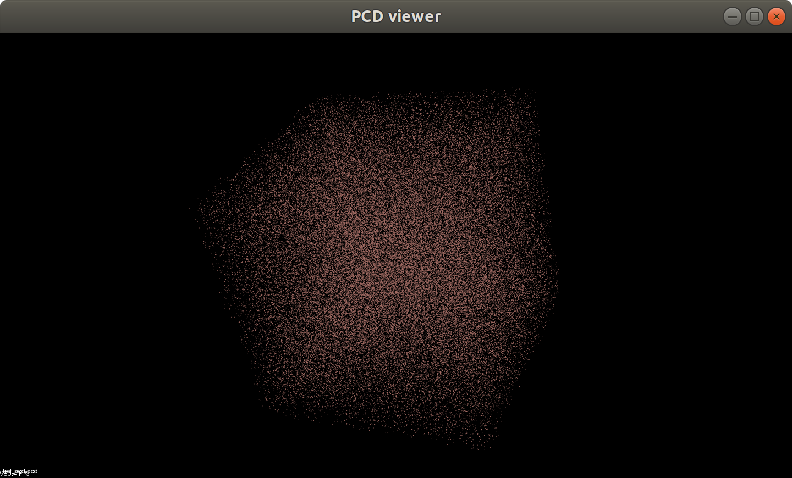

#### Build Instructions
```bash
mkdir build && cd build
cmake -DCMAKE_BUILD_TYPE=Release ..
make
```

#### Run Instructions
```bash
./pcd_write
```

##### Visualization
```bash
pcl_viewer test_pcd.pcd
```

